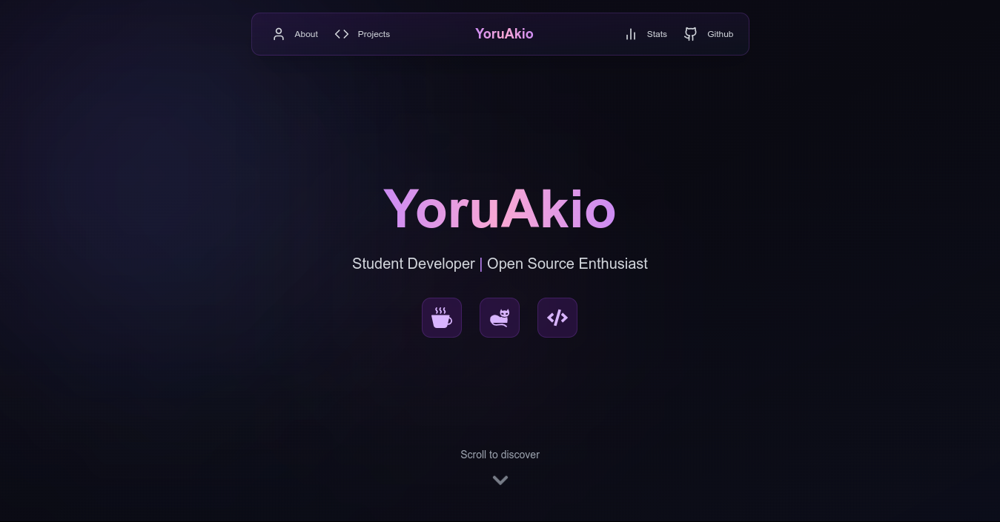

# ✨ Akio Portfolio

<div align="center">

#### *A modern, animated developer portfolio with sleek aesthetics*

[](https://akio.lol)
</br>
[](https://nextjs.org/)
[](https://tailwindcss.com/)
[](https://www.framer.com/motion/)
[](https://docs.github.com/en/rest)

</div>

<br>

## 🌟 Overview

Akio Portfolio is a sophisticated, responsive developer portfolio website featuring elegant animations, dynamic GitHub repository integration, and a modern design aesthetic. Built with Next.js and styled with Tailwind CSS, this portfolio showcases your skills and projects with striking visual effects and smooth interactions.



<br>

## ✨ Features

- **🎭 Rich Animations** — Fluid transitions and micro-interactions using Framer Motion
- **📱 Fully Responsive** — Perfect viewing experience across all devices
- **🔄 Dynamic Content** — Automatically displays your latest GitHub repositories
- **🌈 Modern UI** — Glassmorphism, gradients, and elegant color schemes
- **📊 Interactive Elements** — Engaging hover states and reveal effects
- **🔍 SEO Optimized** — Properly structured metadata for better search visibility
- **🎨 Customizable** — Easily update colors, content, and styling to match your personal brand

<br>

## 🛠️ Technology Stack

<div align="center">

| Frontend | Styling | Animation | Integration |
|:--------:|:-------:|:---------:|:-----------:|
| Next.js  | Tailwind CSS | Framer Motion | GitHub API |
| React    | CSS Modules  | AOS Library   | React Icons |

</div>

<br>

## 🚀 Getting Started

### Prerequisites

- Node.js 14.x or later
- bun, npm, or pnpm

### Installation

```bash
# Clone the repository
git clone https://github.com/yourusername/akio-portfolio.git

# Navigate to the project directory
cd akio-portfolio

# Install dependencies
bun install
# or
npm install
# or
pnpm install
```

### Development

```bash
# Start the development server
bun dev
# or
npm run dev
# or
pnpm dev
```

Open [http://localhost:3000](http://localhost:3000) in your browser to see your portfolio.

<br>

## 🎨 Customization

### Personal Information

Edit `src/pages/index.js` to update:

```javascript
// Update your name and title
<motion.h1 className="text-5xl...">
  YoruAkio  // Change this
</motion.h1>
<motion.p className="text-lg...">
  Student Developer | Open Source Enthusiast  // Change this
</motion.p>

// Update about section
<motion.p className="text-base...">
  Hello! I'm a student developer from Indonesia...  // Change this
</motion.p>
```

### GitHub Integration

Update the GitHub username in the `fetchGithubData` function:

```javascript
const reposRes = await fetch(
  "https://api.github.com/users/YOUR_USERNAME/repos?sort=updated&per_page=6"
);
```

### Styling

The portfolio uses a purple-themed color scheme by default. Modify `tailwind.config.js` to change the color palette:

```javascript
theme: {
  extend: {
    colors: {
      // Replace with your preferred colors
      purple: {
        ...
      },
    }
  }
}
```

<br>

## 📱 Responsive Design

The portfolio is meticulously crafted to look stunning on:

- **Mobile devices** — Optimized navigation and content layout
- **Tablets** — Adaptive design for medium-sized screens
- **Desktops** — Full experience with all visual elements
- **Large displays** — Properly scaled to avoid stretched layouts

<br>

## 🔧 Project Structure

```
akio-portfolio/
├── components/        # Reusable UI components
├── pages/             # Page components and routing
│   ├── api/           # API routes
│   ├── _app.js        # Application setup
│   └── index.js       # Main portfolio page
├── public/            # Static assets
├── styles/            # Global styles
├── package.json       # Dependencies and scripts
└── tailwind.config.js # Tailwind CSS configuration
```

<br>

## 🌐 Deployment

### Deploy on Vercel (Recommended)

The simplest way to deploy your portfolio:

1. Push your code to a GitHub repository
2. Visit [Vercel](https://vercel.com/new) and import your repository
3. Vercel will detect Next.js and set up the build configuration automatically
4. Your portfolio will be deployed to a `.vercel.app` domain instantly

### Other Deployment Options

To build for other hosting platforms:

```bash
# Create a production build
bun run build

# Generate static files (for static hosting)
bun run export
```

You can then host the generated files on Netlify, GitHub Pages, or any static hosting service.

<br>

## 📄 License

This project is licensed under the MIT License - see the LICENSE file for details.

<br>

## 💙 Acknowledgments

- [Next.js](https://nextjs.org/) for the powerful React framework
- [Tailwind CSS](https://tailwindcss.com/) for the utility-first styling
- [Framer Motion](https://www.framer.com/motion/) for the beautiful animations
- [React Icons](https://react-icons.github.io/react-icons/) for the diverse icon set
- [AOS](https://michalsnik.github.io/aos/) for scroll animations
- [Vercel](https://vercel.com) for intuitive deployment

<br>

<div align="center">

### Made with ❤️ by YoruAkio

[](https://github.com/YoruAkio)

</div>